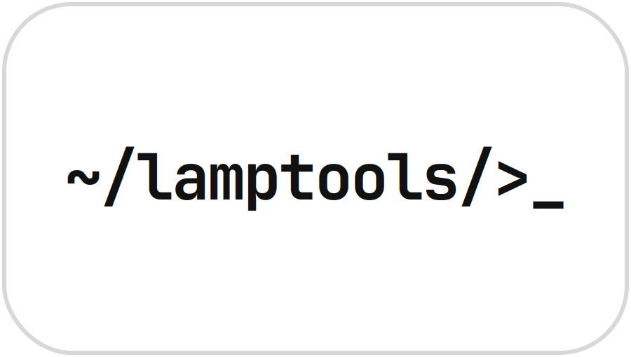

<div align="center">



# LampTools

**A host shell and plugin catalog for small utility tools.**

Install tools on demand. Run them in one place. Build your own.

<a href="https://lamps-dev.dev/tos"></a>
&nbsp;
<a href="https://lamps-dev.dev/privacy"></a>

<br/>


</div>

---

## What is it

LampTools is a Windows desktop app by **Lamp Studios** that works like an app store plus a runtime. The main window gives you navigation and tool "cards," and each tool installs on demand as a downloadable plugin. Think of it as a lightweight catalog you can extend yourself.

- **Host shell**: one window, sidebar navigation, tool cards per category
- **Plugin catalog**: browse tools, install the ones you want
- **Runtime**: installed plugins open right inside the app
- **Extensible**: anyone can author and ship a plugin

---

## Features

- Sidebar navigation (Home, Settings, About, Text Tools) backed by a stacked view
- Tool cards rendered from YAML catalogs, with a verified badge for first-party tools
- On-demand plugin install from a URL, which downloads, validates, and stages atomically
- Three plugin kinds: **web** (opens in browser), **python** (Qt widget with hot-reload), and **webview** (loads a URL in an embedded view)
- Windows version gate (requires Windows 10 1507 or newer)
- A CLI scaffolder for plugin authors

---

## Install

### From the installer (recommended)

Grab the latest `LampTools-Setup-v*.exe` from the [Releases](../../releases) page and run it. Built with Inno Setup.

### From source

Requires [uv](https://docs.astral.sh/uv/) and Python 3.12 or 3.13.

```bash
git clone https://github.com/lamp-studios/lamptools.git
cd lamptools
uv sync
uv run main.py
```

### Build a standalone exe

```bash
uv run pyinstaller --noconfirm lamptools.spec
```

---

## How it works

```
main.py                 entry point, builds MainWindow, sidebar, stacked pages
src/config.py           global config (version, tools dir) + ASCII banner
src/tools_loader.py     scans src/tools/*.yaml, renders tool cards onto pages
src/plugins/            the plugin runtime (install + open)
scripts/make_plugin.py  interactive CLI scaffolder for plugin authors
```

On launch the app checks the registry key
`HKLM\SOFTWARE\Lamp Studios\Lamp Tools\Checks\IsUsing10andabove`
to confirm you're on Windows 10 (1507) or newer.

Page object names map to catalog files, so `TextToolsPage` loads `text_tools.yaml`. Each card shows the title, owner, and description, plus an **Install** or **Open** button depending on whether the plugin is already present.

Installed plugins live under:

```
%LOCALAPPDATA%\LampTools\plugins\<id>
```

---

## The plugin model

A tool is declared in a per-page YAML catalog:

```yaml
- id: base64_tools
  owner: Lamp Studios
  about: Encode and decode base64, fast.
  homepage: https://lamps-dev.dev
  src_download: https://.../base64_tools.lamp   # the bundle, or:
  # web_url: https://...                         # for web-only tools
```

A `.lamp` file is just a zip containing a `plugin.yaml` manifest plus, for python plugins, a `src/<module>/` package that exposes a `build(page)` function returning a Qt widget. On install, the runtime downloads the bundle, validates it's a zip, reads the manifest, checks the `id` and app-version compatibility, then does a staged atomic extract.

### Authoring a plugin

```bash
uv run python scripts/make_plugin.py
```

It prompts for metadata, target page, and kind (python or webview), generates a `plugin.yaml` and starter code from a template (`empty`, `text_io`, `form`, `stacked`), optionally zips the `.lamp` bundle, and optionally drops a catalog entry into the page YAML.

---

## Tech stack

| Layer | Tooling |
|-------|---------|
| Language | Python 3.12–3.13 |
| GUI | PySide6 (Qt 6.11) |
| Deps / workspace | uv |
| Packaging | PyInstaller |
| Installer | Inno Setup |
| Extras | pywin32, PyYAML, requests/urllib, pydub |

---

## Project status

Early, **v1.0**. There's one example page (Text Tools) with a `base64_tools` catalog entry that isn't hosted yet (empty `src_download`). Expect things to move around.

---

## Links

- [Terms of Use](https://lamps-dev.dev/tos)
- [Privacy](https://lamps-dev.dev/privacy)
- Homepage: [lamps-dev.dev](https://lamps-dev.dev)

<div align="center">
<br/>
<sub>Built by <a href="https://discord.lamps-dev.dev">Lamp Studios</a></sub>
</div>
